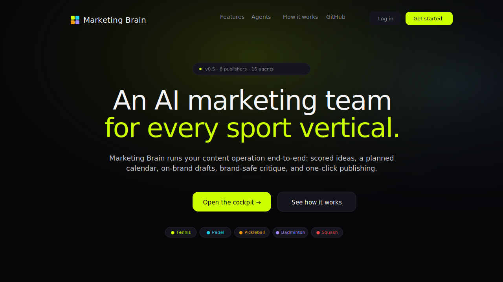
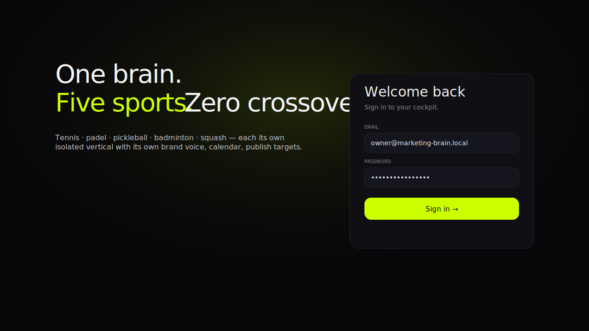
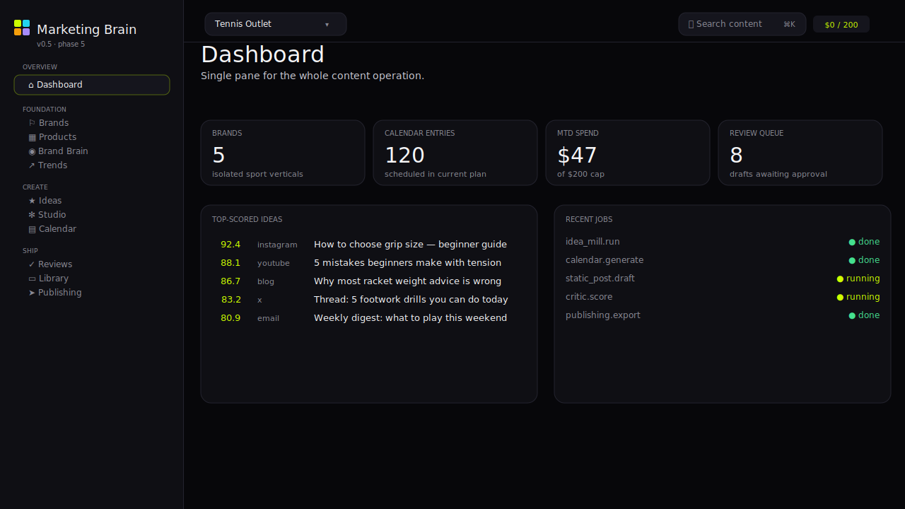
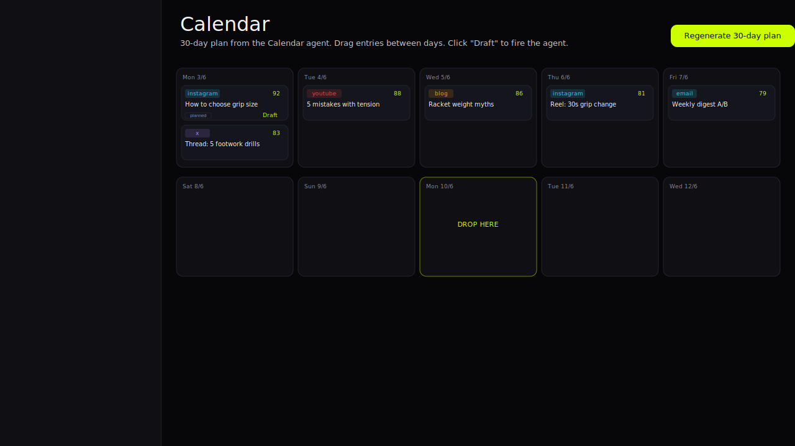
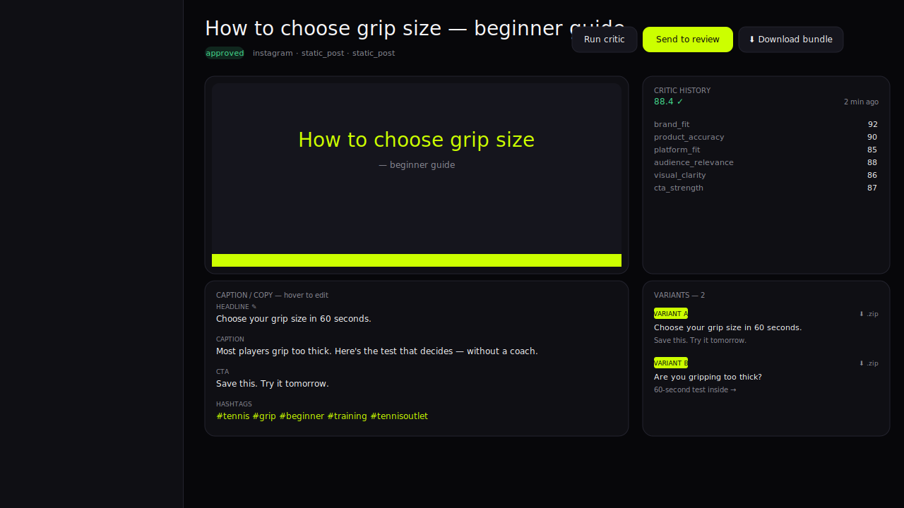

# Marketing Brain — User Guide

A 12-step walkthrough from "I just logged in" to "winning content is teaching the brain". Each step is one screen and one decision.

If you're new, you should be able to finish the loop in 15 minutes. The cockpit nudges you when something's missing.

---

## 1) Land on the marketing site

The public site lives at the root URL. It exists so a teammate (or you in three months) can re-find the cockpit without a bookmark.

- Top-right has **Get started** → routes to the cockpit login.
- The mock dashboard underneath the hero is a real screenshot of what you'll see in step 3.

---

## 2) Sign in

- Default seed credentials: `owner@marketing-brain.local` + the password your admin set in `DEFAULT_OWNER_PASSWORD`.
- If you've enabled 2FA, the form swaps to a 6-digit code after the password is accepted.
- The left half is a brand reminder: **one brain, five sports, zero crossover**. Cross-sport content fails the Critic by design.

> **Tip:** First action after sign-in — go to **Settings → Security** and enable TOTP 2FA. It takes 30 seconds.

---

## 3) Dashboard — what's actually happening

Five things to glance at every morning:

| Card | What it tells you |
|---|---|
| **Brands** | How many sport verticals you own (each is its own data silo) |
| **Calendar Entries** | How full your 30-day plan is |
| **MTD Spend** | LLM + media spend vs. the org-level cap |
| **Review Queue** | Drafts waiting for human approval |
| **Top-Scored Ideas** | What the Idea Mill thinks you should make next |
| **Recent Jobs** | What every agent has just done (refreshes every 5s) |

The cockpit-wide search lives top-right (**⌘K**). It searches across content items + ideas for the selected brand.

---

## 4) Brand Brain — the agents' shared memory

Open **Brand Brain** in the sidebar (under *Foundation*).

Fill in:

- **Voice** — 2-3 sentences in your brand's actual register. Agents read this verbatim.
- **Tone** — "punchy, direct, no hype" or whatever you want.
- **Banned phrases** — one per line. The Critic auto-rejects any content containing these.
- **SEO keywords** — one per line. These boost `brand_fit` scores on the Idea Mill.
- **Competitors / Subreddits** — one per line. Doubles as trend-ingest sources (Reddit hot pulls from these subreddits).

At the bottom, the **Refinement Proposals** panel shows keywords the Brain didn't know about that appeared in your *winning* content. Click "+" on any one or "Accept all" to write them into `seo_keywords`. Your next idea-mill run scores higher.

---

## 5) Trends — feed the scoring engine

Sidebar → **Trends**.

Click **Ingest all** to pull:

1. Reddit `/hot` for every sub in your `competitors` list.
2. Google Trends daily-trending RSS for every geo in your `geo_prompts`.

Each ingested topic gets a signal_strength (0-100) and slope (-1 to 1). The Idea Mill multiplies these with recency decay when scoring an idea.

You can also paste a single trend manually (top of page) — handy when you spot something on X or a podcast.

---

## 6) Ideas — generate, sort, re-score

Sidebar → **Ideas**.

- **Generate 40 ideas** runs the Idea Mill agent. It reads brand brain + products + trends and produces ~40 scored ideas across every channel.
- **Re-score** re-runs the scoring engine over existing ideas (e.g. after you update banned phrases or SEO keywords).
- Sort by score (default), recency, or score-ascending.
- Filter by platform.

The **score column** is the truth — it's the weighted sum of 6 signals. The **reason** column tells you why this idea scored what it did.

---

## 7) Calendar — drag-drop month grid

Sidebar → **Calendar**.

- **Regenerate 30-day plan** — Calendar Agent fills the grid from top-scored ideas, honouring per-channel cadence caps (max 2 IG posts/day, max 1 blog/day, etc.) and no more than 1 long-form per day.
- **Drag-drop** any entry between days.
- Each cell shows: platform pill (colour-coded) · score · short angle.
- Click **Draft** to fire the matching agent for that entry. Click **Open** if it's already drafted.

> **Tip:** When a draft you don't like comes back, click the **↻ regenerate** action on the calendar entry to re-fire the same agent for a fresh take.

---

## 8) Studio — the content detail view

This is where you spend the most time. Studio renders the content correctly for its type:

| Content type | Studio renders |
|---|---|
| Static post | Hero image + editable headline / caption / hashtags / CTA |
| Carousel | 6 slide thumbnails in a grid + slide-level captions |
| Blog | Title + meta + h2 sections + body, all paginated |
| Email | Headline + paragraphs + CTA preview as a real-ish email |
| Short / Long video | Inline `<video controls>` player + chapter list (long) or beats (reel) |
| Thread (X / LinkedIn) | Numbered post sequence with HOOK / CTA tags |
| Ads | Variant grid (A/B/C) with format header + target audience |

**Hover any copy field** to reveal a tiny pencil — edit inline, hit ⏎ to save. The change is mirrored onto Variant A.

**Right rail** has:

- Critic history — every score the Critic v2 has given this item, drillable by criterion
- Variants — A / B (or A / B / C for ads). Each variant has a **⬇ .zip** button that downloads *just that variant* as a portable bundle (variant.json + caption.txt + hashtags.txt + assets/)

**Top bar actions:**

- **Run critic** — cross-sport hard gate first, then LLM rubric. Persists a `CriticReview` row.
- **Send to review** / **Approve** — state machine transitions, role-gated.
- **Download bundle** — the full content item as a zip (image + caption + metadata + everything).
- **Export to URL** — same bundle, but saved to storage and you get a sharable URL.

---

## 9) Reviews — bulk approve

Sidebar → **Reviews**.

Every drafted + under-review item lives here. Tick the checkbox on each one to enable **bulk actions** — appears in the header as "Approve N".

The Critic auto-runs once per draft, but you can re-run it (button on each row) after editing the copy.

> **Role gate:** Only `growth_head` and above can Approve. `marketer` can edit + send-to-review.

---

## 10) Library — every asset, downloadable

Sidebar → **Library**.

Grid of every asset every agent has produced for this brand: images, video stills, slides, audio. Hover any tile to reveal a **⬇** in the corner — downloads just that asset.

Filter by kind (image / carousel / video / audio).

---

## 11) Publishing — native publish or export bundle

Sidebar → **Publishing**.

Lists every **approved** item. Top of the page shows your connected Publish Targets (✓ creds = will publish via API; otherwise will fall back to export bundle).

Per row:

- **Export** — generates a fresh bundle URL
- **Publish now** — routes through the right native publisher

Multi-select checkboxes give you:

- **Publish N** — sequential native publish across selected items
- **Download N.zip** — zip-of-zips for hand-off to a creative team

To wire a native target, go to **Settings → Publish Targets** and paste JSON credentials for one of:

| Platform | Credentials JSON shape |
|---|---|
| X (Twitter) | `{"bearer_token": "AAA…"}` (user-context, write scope) |
| Instagram | `{"access_token": "EAA…", "ig_user_id": "1784…"}` |
| LinkedIn | `{"access_token": "AQ…", "author_urn": "urn:li:person:…"}` |
| Pinterest | `{"access_token": "pina_…", "board_id": "1234"}` |
| YouTube | `{"access_token": "ya29.…"}` |
| TikTok | `{"access_token": "act…"}` (requires business-verified app) |
| Klaviyo | `{"api_key": "pk_live_…", "list_id": "ABC", "from_email": "…"}` |
| Webhook | `{"webhook_url": "https://…", "secret": "shared-secret"}` |

---

## 12) Analytics + Brand Brain learning loop

After publishing, head to **Analytics**:

- **Record a metric** — quick manual form (content_id + impressions / engagements / clicks / revenue)
- **Upload CSV** — batch ingest (one row per content item)
- **Pull GA4** / **Pull Meta** (one button each, paste an OAuth access token) — populates `ContentPerformance` rows automatically

Once you have performance data:

1. Go back to **Brand Brain**.
2. Scroll to **Refinement Proposals** at the bottom.
3. The system analyses the last 30 days of winning content (top-engagement) and shows:
   - **+ keyword** chips — keywords from winners that aren't yet in `seo_keywords`
   - **Voice exemplars** — CTAs / captions from winners (so you can copy the phrasing)
   - **Channel mix shift** — which platforms over-indexed in winners
   - **Banned regressions** — winners that contained your banned phrases (alarm)
4. Click "+" on any keyword or **Accept all**.
5. Re-run **Ideas → Generate 40** — the new cycle scores higher on what's actually working.

That closes the loop. The Brain learns from your audience without you telling it anything new.

---

## Per-creative downloads (the "take out individual creatives" path)

Three levels of granularity, all accessible from the cockpit:

| What | Where | Endpoint |
|---|---|---|
| **Single asset** (image, video, slide) | Library card hover-overlay · Studio media preview | `GET /content/{id}/download/asset/{asset_id}` |
| **Single variant** (A/B/C as zip) | Studio right rail → ⬇ .zip per variant | `GET /content/{id}/download/variant/{variant_id}` |
| **Full content item bundle** | Studio top bar → Download bundle | `GET /publishing/export/{id}/download` |
| **Bulk** (multiple approved items as zip-of-zips) | Publishing → select rows → Download N.zip | `POST /publishing/export/bulk` |

Every download is HTTP `Content-Disposition: attachment` with a sensible filename — they just save into your downloads folder.

---

## Full automation path (the "and automated also" path)

Once you trust the loop:

1. **Schedule** the Idea Mill: hit `POST /brands/{id}/ideas/generate?count=40` from a cron / GitHub Action / Render scheduled job once a day.
2. **Schedule** the Calendar Agent: `POST /brands/{id}/calendar/generate` weekly.
3. **Schedule** Trend ingestion: `POST /brands/{id}/trends/ingest` every 6 hours.
4. **Auto-draft** approved-status items into the worker (Phase 5 — currently each entry needs a click on Draft).
5. **Auto-publish** any content where critic_total > 85 and status=approved (set a role-gated webhook on transition → published).

The API surface is documented at `/docs` (Swagger UI on your deployed API) — every cockpit button maps to a single HTTP endpoint, and your CI / Zapier / n8n can hit it directly with the same JWT.

---

## Cheat sheet

| You want to… | Click |
|---|---|
| See what's happening overall | Dashboard |
| Teach the agents your voice | Brand Brain |
| Refresh trend data | Trends → Ingest all |
| Get 40 fresh ideas | Ideas → Generate 40 |
| See your month | Calendar |
| Edit AI-generated copy | Studio → hover any field → pencil |
| Approve in bulk | Reviews → ☐ → Approve N |
| Download one image | Library → hover → ⬇ |
| Download one variant | Studio → Variants → ⬇ .zip |
| Publish to X / IG / LI / etc | Publishing → Publish now |
| Hand-off many to a designer | Publishing → ☐ → Download N.zip |
| Find that one post | ⌘K |
| Set a different accent colour | Settings → White-label theme |
| Enable 2FA | Settings → Security |
| Configure publishers | Settings → Publish Targets |
| Learn from winners | Brand Brain → Refinement Proposals → Accept |

Cheat-sheet ends here. The whole cockpit is designed so that this page becomes muscle memory after one full loop.
